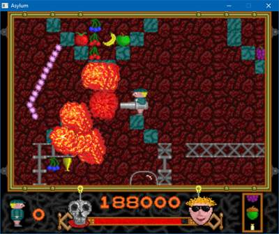

SDL2 Asylum
===========

This is a modern port of the platform game *Asylum*.  It runs under:

- Windows -- portable, so no installation necessary
- Linux
- WebAssembly
- Other Unix-based systems like Mac OS X -- untested, but should work

Play the Game in your Browser
-----------------------------

[Play Asylum!](https://gmh-code.github.io/asylum/)

Look out for the teleporters, otherwise you may get stuck!  They look like this in the *Ego*, *Psyche* and *Id* levels respectively:

  

Stand in the centre and press `Down` to use them.

I recommend trying *Psyche* first, simply because I found it the most fun.  If you find that too difficult, *Ego* is technically the first, and easiest level.

Screenshots
-----------

   

Default Keys
------------

The keys can be redefined in the menu.  These are the defaults:

    Z      - Left
    X      - Right
    ;      - Up (Jump)
    .      - Down (Teleport)
    Return - Fire
    Esc    - Menu

Tips
----

- Hold `Fire` to angle a rocket launcher, or to rapid-fire a minigun.
- The `Megablam 5000 Minigun` is the second most powerful weapon in the game, and whilst it can fire endlessly, it can also clear nearly half the screen in a single shot.
- The `Megablam 5000 Rocket Launcher` only has 6 shots.  However, it is so powerful that it can blast through some of the stronger parts of the level.  This includes vaporising teleporter bases, breaking the link.
- The `Weird One!` minigun is quite rare.  It has a special ability, so be careful just endlessly firing it.
- Try blasting enemies at point blank range with a powerful gun to get more bonuses.
- You get a bonus life for every 100,000 points in this version of the game.
- Occasionally it's better to *not* pick up items.
- There aren't always arrows showing you the way.

Original Authors
----------------

The original versions of this game were written by:

- Andy Southgate - The original Archimedes version.
- Hugh Robinson - The C / SDL port, which this version is based upon.

List of Improvements
--------------------

#### Play

- The game plays at the original speed, as per Acorn computers, but with lag compensation to cater for modern pre-emptive CPUs.
- Restoring games doesn't result in an injury effect if you have under 100% health.
- If you have a weapon when saving a game, it will refrain from firing when you resume.
- Rocket launchers with starburst now have projectiles emitted at the proper time.
- In this version, an extra life is awarded for every 100,000 points, which gives an incentive to get the bonuses in sequence.
- Completing the bonus sequence whilst already in a timed bonus area will award 10,000 points instead of getting you stuck.
- If you are playing online and save your progress, you should be able to restore the game even after closing the browser.

#### Build

- The latest version of GCC can now be used to build and link the project to the latest version of *SDL2* and *SDL2_mixer*.
- Runs like the original on current versions of Windows.
- Fixed C compiler warnings when using `-Wall -Wextra` as arguments.
- Many redundant parts of the code have been removed.  Some have been temporarily removed if the feature is incompatible or not working on modern systems.
- Builds in WebAssembly and plays at full speed even on older systems.
- If playing in a browser, user data is saved in IDBFS (the browser's database).

#### Display

- Upgraded the rendering system to SDL2.
- Fixed text such as 'Snuffed It!' causing crashes.
- Removed OpenGL rendering mode (I may reinstate this later).  SDL2 rendering is fast enough, supports all the necessary features, and is much less work to manage.
- Added the ability to play in different resolutions when using SDL2 mode.
- Reinstated the 25Hz low CPU power mode and added a toggle item in the *Video Options* menu.  This is very handy for slow systems when using WebAssembly.

#### Half-Scale (Double-Size) Mode

- Using this mode is considered cheating, because it exposes routes to areas not obvious in the original game!
- This mode now works with regular SDL2.  Sigmund, the map, sprites, bonus counter, onscreen text, health bar, score/lives counter, border and more now all resize using a different method.
- Enemies and lifts/elevators will spawn and move at double-range.
- Projectiles, such as bullets, embers and bonuses, travel twice the distance.
- There is a potential for objects to not spawn properly in this mode, since there are limits on sprites and the visual playfield is much larger than the original game is designed to handle.

#### Sound

- Fixed missing effects when using any of the minigun variants.
- Fixed missing effects when collecting lots of bonuses.
- Changed sample quality from 22.05KHz from 44.1KHz.
- Fixed incorrect sound and music playback rates.

#### Menus

- Pause menu (Esc) now animates in properly.
- Removed joystick option (for now).
- Removed OpenGL and modified other menu options.

#### Keyboard

- Scancodes are now used.  This is because key symbols are very limited in SDL2, and Unicode input is no longer supported.  This means almost all keys can now be defined, including *Shift* and *Ctrl*.

#### I/O

- Saving/loading now works for games, high scores and options on Windows.

WebAssembly Notes
-----------------

If you use GZ compression (or better, Brotli, pre-compressed files, and good caching headers) on a web server, the entire game can be sent to the client in under 700KB.  This results in an almost immediate load, and includes:

- All the game code
- 27 levels
- 21 sound effects
- 6 music tracks
- All the sprites and images for all the levels
- The GUI and its graphics

The CPU should sleep between frames and compensate for delays on the next frame, so usage should be fairly low.

Other Points
------------

- The game still contains regular C, and compiles using GCC.  It will compile in C++ mode too, but only C features are used.
- When a level disintegrates upon pressing the 'Shut Down' button, the shrinking sprites are not the same as the ARM version.  Game play is unaffected.
- Some enemies may not appear until you get close to them, especially if there are lots of sprites on-screen.
- Bypassing the scale limit can result in enemies not spawning, or spawning with an `X` and blocking access to routes.
- This version of the game is based on an unmodified copy of 0.3.2 from Hugh Robinson (*blotwell*).
- The original README is now named README.original to avoid conflicts.

Cheat Mode
----------

Like the original game, this version supports cheats.  In the original, you had to press both `ALT` keys and click the middle mouse button whilst the introductory scroll text was showing.  In this version, you can do the same, but click *any* mouse button.

Previously, you could also start in a specific sub-level by quickly holding down a numeric key after starting the game and before the zone finished loading.  In this version, you can press a key during play to instantly teleport.

The keys are as follows:

- `F1`: Rotate through miniguns (random in the original).
- `F2`: Rotate through rocket launchers (also previously random).
- `F3`: Restore health to maximum.
- `F4`: 9 lives (not present in the original game).
- `1`: Go back to the zone's hub level.
- `2`-`9`: Switch to a neuron sub-level.

Careless usage of cheats can break the game!  For example:

- Using the Megablam rocket launcher in areas/levels not designed for it could destroy routes.
- Completing neuron sub-levels multiple times will end the game early.

Building from Source
--------------------

The method for this depends on your target architecture:

- For Windows, install a modern version of the *MinGW GNU Compiler Collection*.  You will also need to make sure MinGW's `bin` folder is in the path so the build tools can be found.
- For Linux or other Unix-based systems, ensure you have a modern version of the `gcc` compiler installed.
- For WebAssembly, you'll need to have `emcc` (Emscripten's GCC-compatible WebAssembly compiler) installed and working.  Building with 3.1.34 was successful, and later versions should also be okay.

In many cases you will need to separately install the *SDL2* and *SDL2_mixer* libraries and includes, however Emscripten should do this for you if WebAssembly is your build target.

The `Makefile` is configured to use the `emcc` WebAssembly compiler by default.  You can change the target to `mingw` (to build a native Windows app) or `generic` (for Linux/Unix) at the top of the file.

To build the game:

    cd <directory>
    make

This will produce the executable file which can be run the standard way; by double-clicking the file on Windows, or running `./asylum` on Linux.

If you're using Linux and want to install the game, add:

    sudo make install

Note that the installation code is untested and mostly remains the same as the original version!
